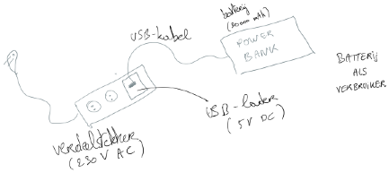

# Energie en vermogen

Laten we het gebruik van **elektriciteit** beschouwen voor **energietransport** (en dus niet voor **informatietransport** zoals bij elektronica meestal het geval is).

Het (Europese) elektriciteitsnet gebruikt **wisselstroom** (**AC** = Alternating Current) om elektrische energie (in Joule `[J]` (S.I.-eenheid) of kilowatt-uur `[kWh]` (populaire eenheid) te transporteren van de **energiecentrales** naar de (industriële en residentiële) **verbruikers**.

`1 kWh = 1 kW * 1 uur = 1000 W * 3600 seconden = 3 600 000 J = 3,6 MJ`

> Deze omzetting gebeurt m.b.v. S.I.-eenheden en -voorvoegsels.
> Denk eraan: de S.I.-eenheid van tijd is de **seconde**.

Toestellen werken - afhankelijk van wat ze aan het doen zijn - aan een bepaald **vermogen** (in Watt `[W]` of Joule per seconde `[J/s]`). Ze hebben per seconde `[s]` een bepaalde hoeveelheid energie `[J]` nodig.

**Hoe intensiever een toestel wordt gebruikt, hoe groter het (ogenblikkelijk) vermogen** en dus hoe meer energie per seconde verbruikt wordt. 

Voorbeelden:

-   Gamen  is voor de game-PC een **zwaardere belasting** (b.v. 450 W) dan op het Internet surfen (b.v. 50 W)
-   Een broodrooster heeft meerdere standen

De kostprijs op de energiemarkt wordt meestal uitgedrukt in kWh. Voorbeelden:

-   € 0,25 per kWh elektriciteit (`0,25` in `€/kWh`)
-   € 0,05 per kWh aardgas (`0,05` in `€/kWh`)

We kunnen i.p.v. het woord energie ook het woord arbeid gebruiken omdat energie wordt gebruikt om arbeid te leveren.

Voorbeeld v.e. energieberekening op jaarbasis:

Toestel | Operationele tijd per jaar `[uur]` | Vermogen `[kW]` | Jaarlijks energieverbuik `[kWh]`
:--|--:|--:|--:|
ijskast | 365 dagen * 24 uur = 8760 uur | 0,02 kW | 8760 * 0,02 = 175,2 kWh |
microgolf | 365 dagen * 0,25 uur = 91,25 uur | 0,7 kW | 91,25 * 0,7 = 63,875 kWh|
broodrooster | 52 dagen * 5 min = 52 * 0,12 uur = 6,24 uur | 0,75 kW | 6,24 * 0,75 = 4,68 kWh |
laptop | 200 dagen * 4 uur = 800 uur | 0,05 kW | 800 * 0,05 = 40,0 kWh |
game-PC | 200 dagen * 1,5 uur = 300 uur | 0,35 kW | 300 * 0,35 = 105,0 kWh |
**TOTAAL**| | | ± 389 kWh |

Batterijen leveren elektrische energie.  Ze werken met **gelijkstroom** (**DC** = **Direct Current**).

**Herlaadbare batterijen** kunnen ook energie **verbruiken**, nl. wanneer ze opgeladen worden.

> Je ziet een typische verdeelstekker om één stopcontact te splitsen in meerdere stopcontacten. Één van de sockets bevat een USB-lader met een USB-output (met daarom een uitgangsspanning van `5 Volt`). Een power bank van `20 000 mAh` wordt opgeladen. De power bank is op dit moment een **verbruiker** van energie uit het **net**.

> Je ziet een power bank die met een USB-kabel een smartphone oplaadt. De power bank is momenteel dus een **energiebron** voor de batterij van de smartphone.

> De capaciteit van batterijen wordt vaak uitgedrukt in `mAh` (milli-Ampère-uur). Wanneer we vermenigvuldigen met de werkspanning (in dit geval `5 V`) weten we de hoeveelheid energie die de batterij bevat uitgedrukt in `J` of dus `kWh`.

> `20000 mAh * 5 V = 20 Ah * 5 V = 100 Wh = 0.1 kWh`

Het **maximale vermogen** (in Watt `[W]`) van een energie-bron (b.v. een batterij of een batterij-lader) zegt hoeveel energie per seconde (`[J/s]`) maximaal kan worden geleverd.

Bij een batterij bepaalt het vermogen de **(ont)laadsnelheid**.

> Een lader van `65 W` kan een batterij sneller opladen dan een lader van `45 W`.

De snelst mogelijke ontlading van een batterij gebeurt met een **kortsluiting**. Dit is slecht voor de batterij en kan gevaarlijk zijn voor de omgeving! Door chemische reacties kunnen batterijen ontploffen!

Toestellen moeten steeds binnen hun technische specificaties gebruikt worden om een correcte en **veilige** werking te blijven garanderen. We kunnen energiebronnen, elektriciteitskabels of andere toestellen **overbelasten**. Risico's zijn o.a. het opwekken van hitte en bijgevolg **brandgevaar**. Sommige toestellen hebben ingebouwde begrenzingen of **beveiligingen**. Beveiligingen kunnen stuk gaan (zonder dat het toestel zelf stuk gaat).